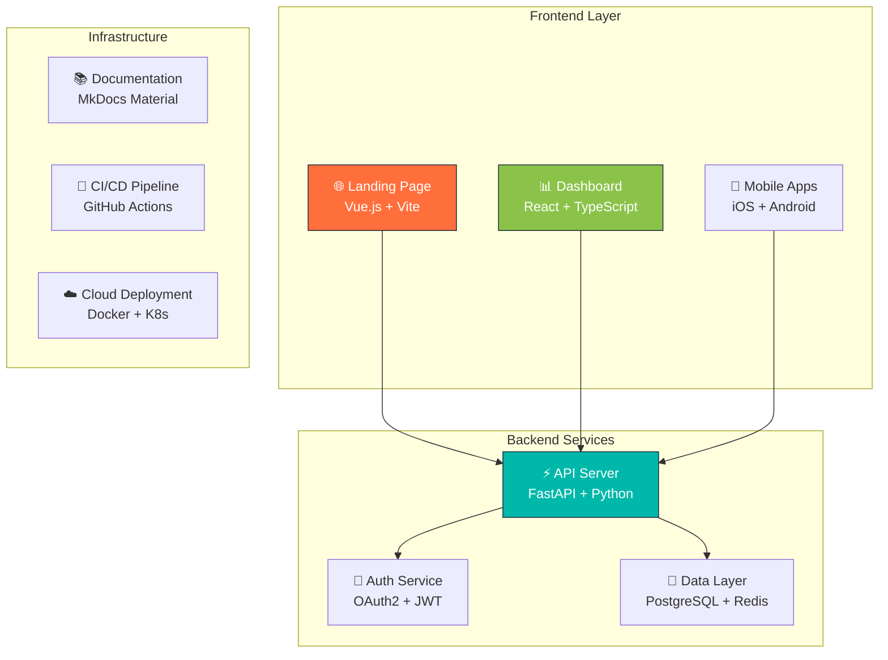

# 🏦 TruLedgr

<div align="center">

**The Modern Financial Infrastructure Platform**

*Empowering businesses and individuals with comprehensive financial tools that balance trust, security, and innovation.*

[]()
[](LICENSE)
[]()

[📚 **Documentation**](https://docs.truledgr.app) • [🚀 **API Docs**](https://api.truledgr.app/docs) • [💬 **Discussions**](https://github.com/mcguiretechnology/truledgr/discussions) • [🐛 **Issues**](https://github.com/mcguiretechnology/truledgr/issues)

</div>

---

## ✨ What is TruLedgr?

TruLedgr is a comprehensive financial platform that bridges the gap between traditional financial reliability and modern digital innovation. Built with a **microservices architecture**, it provides everything from personal finance management to enterprise-grade financial tools.

### � Core Features

- **💳 Account Management** - Multi-bank account aggregation and tracking
- **📊 Transaction Processing** - Real-time categorization and analytics  
- **🔒 Enterprise Security** - OAuth2, JWT, and role-based access control
- **📱 Multi-Platform** - Web dashboard, mobile apps, and comprehensive APIs
- **🌐 Developer-First** - RESTful APIs with interactive documentation
- **⚡ Real-Time** - Live balance updates and instant notifications

---

## 🏗️ Architecture

TruLedgr uses a **distributed microservices architecture** with independent repositories for maximum flexibility and focused development:

<div align="center">



</div>

### 📦 Repository Structure

| Repository | Purpose | Tech Stack | Status |
|:-----------|:--------|:-----------|:-------|
| **[truledgr](https://github.com/mcguiretechnology/truledgr)** | 🏠 Main hub & coordination | Scripts, Docs, DevOps | 🟢 **Active** |
| **[TruLedgr-API](./TruLedgr-API)** | ⚡ Backend API server | FastAPI, PostgreSQL, Redis | 🟡 **Development** |
| **[TruLedgr-Dash](./TruLedgr-Dash)** | 📊 Web dashboard | React, TypeScript, Tailwind | 🟡 **Development** |
| **[TruLedgr-Land](./TruLedgr-Land)** | 🌐 Marketing website | Vue.js, Vite, Cloudflare | 🟡 **Development** |
| **[TruLedgr-Apple](./TruLedgr-Apple)** | 🍎 iOS/macOS apps | Swift, SwiftUI | � **Planned** |
| **[TruLedgr-Android](./TruLedgr-Android)** | 🤖 Android app | Kotlin, Jetpack Compose | 🔴 **Planned** |

---

## 🚀 Quick Start

### 🔧 Prerequisites

- **Node.js** 18+ and **npm**
- **Python** 3.11+ and **pip**
- **Docker** and **Docker Compose**
- **Git** with SSH keys configured

### ⚡ One-Command Setup

```bash
# Clone and set up entire development environment
git clone https://github.com/mcguiretechnology/truledgr.git
cd truledgr
./scripts/setup_dev_environment.sh
```

### 🏃‍♂️ Start Development Servers

```bash
# Start all services in development mode
npm run dev:all

# Or start individual services
npm run dev:api     # API server → http://localhost:8000
npm run dev:dash    # Dashboard → http://localhost:3000  
npm run dev:land    # Landing page → http://localhost:3001
npm run dev:docs    # Documentation → http://localhost:8001
```

### 🧪 Run Tests

```bash
# Run comprehensive test suite
npm run test:all

# Component-specific tests
npm run test:api
npm run test:dash
npm run test:integration
```

---

## 💻 Development

### 🛠️ Development Tools

This repository provides powerful tools for multi-service development:

- **🎯 VS Code Workspace** - Multi-root workspace for all repositories
- **� Development Scripts** - One-command setup and service orchestration
- **🧪 Integration Testing** - Cross-service testing capabilities  
- **� Monitoring Dashboard** - Real-time service health monitoring
- **� Hot Reload** - Automatic reloading across all services

### 📋 Development Workflow

1. **🍴 Fork** the main repository
2. **📥 Clone** your fork locally
3. **🔧 Setup** development environment with `./scripts/setup_dev_environment.sh`
4. **🌿 Create** a feature branch (`git checkout -b feature/amazing-feature`)
5. **✨ Make** your changes
6. **🧪 Test** your changes (`npm run test:all`)
7. **📤 Push** to your fork (`git push origin feature/amazing-feature`)
8. **🔀 Open** a Pull Request

### 🎯 Contributing to Specific Components

Each component has its own development guide:

- **API Development** → [TruLedgr-API/README.md](./TruLedgr-API/README.md)
- **Dashboard Development** → [TruLedgr-Dash/README.md](./TruLedgr-Dash/README.md)
- **Landing Page** → [TruLedgr-Land/README.md](./TruLedgr-Land/README.md)

---

## 📚 Documentation

<div align="center">

| 📖 **Type** | 🔗 **Link** | 📝 **Description** |
|:------------|:------------|:-------------------|
| 🏠 **Main Documentation** | [docs.truledgr.app](https://docs.truledgr.app) | Comprehensive user and developer guides |
| 🚀 **API Reference** | [api.truledgr.app/docs](https://api.truledgr.app/docs) | Interactive API documentation |
| 🎨 **Brand Guidelines** | [Brand Guide](https://docs.truledgr.app/branding/) | Colors, typography, and design system |
| 🏗️ **Architecture** | [Architecture Overview](./docs/architecture.md) | System design and technical decisions |
| 🤝 **Contributing** | [Contributing Guide](./CONTRIBUTING.md) | How to contribute to the project |

</div>

---

## 🌟 Key Features

### 🔐 Security First
- **OAuth2 + JWT** authentication
- **Role-based access control** (RBAC)
- **Audit logging** for all financial transactions
- **Enterprise-grade encryption** at rest and in transit

### 📊 Comprehensive Analytics
- **Real-time balance tracking** across multiple accounts
- **Automated transaction categorization** with AI assistance
- **Custom reporting** and data export capabilities
- **Trend analysis** and financial insights

### 🚀 Developer Experience
- **RESTful API** with OpenAPI specification
- **Interactive documentation** with live examples
- **SDK and client libraries** for multiple languages
- **Webhook support** for real-time integrations

### 📱 Multi-Platform Support
- **Responsive web dashboard** for desktop and tablet
- **Native mobile apps** for iOS and Android
- **Progressive Web App** (PWA) capabilities
- **API-first design** for custom integrations

---

## 🚢 Deployment

### 🐳 Docker Deployment

```bash
# Production deployment with Docker Compose
docker-compose -f docker-compose.prod.yml up -d

# Development environment
docker-compose up -d
```

### ☁️ Cloud Deployment

TruLedgr supports deployment on major cloud platforms:

- **🔵 Azure** - ARM templates and Azure DevOps pipelines
- **🟠 AWS** - CloudFormation and CodePipeline integration
- **🟢 Google Cloud** - Kubernetes and Cloud Build
- **🟣 DigitalOcean** - App Platform and Kubernetes

See [deployment documentation](./docs/deployment/) for detailed guides.

---

## 📊 Project Status

<div align="center">

| Component | Development | Testing | Documentation | Deployment |
|:---------:|:-----------:|:-------:|:-------------:|:----------:|
| **API Server** | 🟡 70% | 🟡 60% | 🟢 90% | 🔴 30% |
| **Dashboard** | 🟡 50% | 🔴 20% | 🟡 70% | 🔴 10% |
| **Landing Page** | 🟢 90% | 🟡 70% | 🟢 85% | 🟡 60% |
| **Mobile Apps** | 🔴 Planned | 🔴 Planned | 🔴 Planned | 🔴 Planned |
| **Documentation** | 🟢 85% | ➖ N/A | 🟢 95% | 🟢 80% |

**Legend:** 🟢 Complete/Excellent • 🟡 In Progress/Good • � Not Started/Needs Work • ➖ Not Applicable

</div>

---

## 🤝 Contributing

We welcome contributions from developers of all skill levels! Here's how you can help:

### 🎯 Ways to Contribute

- **🐛 Bug Reports** - Found an issue? Let us know!
- **✨ Feature Requests** - Have an idea? We'd love to hear it!
- **💻 Code Contributions** - Submit PRs for bug fixes or new features
- **📚 Documentation** - Help improve our docs and guides
- **🧪 Testing** - Write tests and help with QA
- **🎨 Design** - UI/UX improvements and design suggestions

### 📞 Community

- **💬 Discussions** - [GitHub Discussions](https://github.com/mcguiretechnology/truledgr/discussions)
- **� Issues** - [GitHub Issues](https://github.com/mcguiretechnology/truledgr/issues)
- **📧 Email** - [support@truledgr.app](mailto:support@truledgr.app)

---

## 📄 License

This project is licensed under the **MIT License** - see the [LICENSE](LICENSE) file for details.

---

## � About McGuire Technology

<div align="center">

**TruLedgr** is developed by [**McGuire Technology, LLC**](https://mcguire.technology) - a technology company focused on building innovative financial and business solutions.

*Copyright © 2025 McGuire Technology, LLC. All rights reserved.*

---

<div align="center">

**⭐ Star this repository if you find TruLedgr useful!**

[🚀 **Get Started**](https://docs.truledgr.app) • [📝 **Contributing**](./CONTRIBUTING.md) • [💬 **Discussions**](https://github.com/mcguiretechnology/truledgr/discussions)

</div>

</div>
