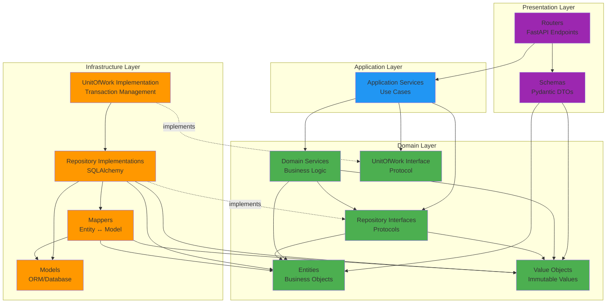
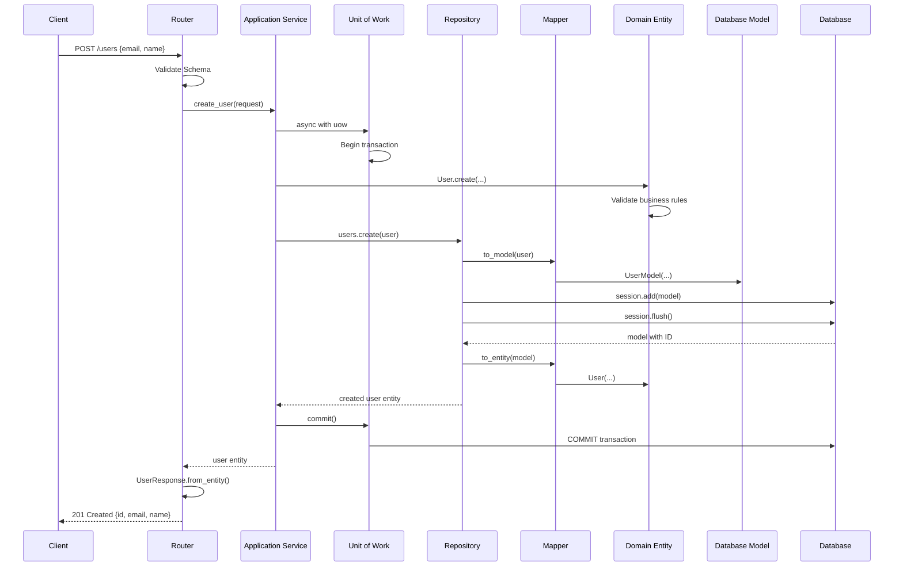

# Domain-Driven Design & Clean Architecture

## Overview

The TruLedgr API follows **Domain-Driven Design (DDD)**, **Clean Architecture**, and **Dependency Inversion Principle** to create a maintainable, testable, and decoupled codebase.

### 💡 The Golden Rule

> **If a component only exists to support another component, colocate them. If a component has value independently, separate it.**

This fundamental principle guides all organizational decisions in our codebase. For example, models and mappers live in `repositories/` because they exist solely to support repository implementations. See [detailed explanation](MODELS_MAPPERS_LOCATION.md).

## Core Architectural Principles

### 1. Domain-Driven Design (DDD)
- Business logic is isolated in the domain layer
- Rich domain models with behavior, not anemic data containers
- Ubiquitous language shared between developers and domain experts
- Clear boundaries between different contexts (bounded contexts)

### 2. Clean Architecture
- Dependencies flow inward toward the domain
- Inner layers have no knowledge of outer layers
- Domain layer is framework-agnostic and purely Python
- Infrastructure concerns (database, API, external services) are isolated

### 3. Dependency Inversion Principle
- High-level modules (domain) don't depend on low-level modules (infrastructure)
- Both depend on abstractions (interfaces/protocols)
- Abstractions are owned by the domain layer
- Concrete implementations are in infrastructure layer

## Project Structure

```
api/
├── entities/              # Domain Entities (business objects with identity)
├── value_objects/         # Domain Value Objects (immutable, identity-less)
├── repositories/          # Repository Interfaces (Protocols) & Implementations
│   ├── user.py           # UserRepository Protocol (interface)
│   ├── session.py        # SessionRepository Protocol (interface)
│   ├── repositories.py   # Concrete SQLAlchemy implementations
│   ├── models.py         # SQLAlchemy ORM models (database schema)
│   ├── mappers.py        # Entity ↔ Model mappers
│   └── base.py           # UnitOfWork Protocol
├── services/              # Domain & Application Services
├── routers/               # API Endpoints (Presentation Layer)
├── schemas/               # Pydantic DTOs (API contracts)
├── config/                # Configuration management
├── exceptions/            # Custom domain exceptions
├── utils/                 # Shared utilities
├── locales/               # Internationalization
└── tests/                 # Test suite
```

## Component Types & Purposes

### Domain Layer Components

#### **Entities** (`entities/`)
**Purpose**: Core business objects with unique identity that persists over time.

**Characteristics**:
- Have a unique identifier (ID)
- Contain business logic and behavior
- Mutable state (can change over time)
- Identity remains constant even if attributes change
- Framework-agnostic (no database, no FastAPI dependencies)

**Examples**:
- `User` - represents a user in the system
- `Account` - a financial account
- `Transaction` - a financial transaction
- `Tenant` - a multi-tenant organization

**Key Principle**: Entities encapsulate business rules and validation logic.

#### **Value Objects** (`value_objects/`)
**Purpose**: Immutable objects that describe domain concepts without identity.

**Characteristics**:
- No unique identifier
- Immutable (once created, cannot be changed)
- Equality based on values, not identity
- Can be shared across entities
- Self-validating (invalid value objects cannot exist)

**Examples**:
- `UserId` - strongly-typed user identifier
- `EmailAddress` - validated email with business rules
- `Money` - amount + currency (always paired)
- `Currency` - enumeration of supported currencies
- `PersonRole` - user roles (ADMIN, MEMBER, VIEWER)

**Key Principle**: Value objects prevent primitive obsession and encapsulate validation.

#### **Repository Interfaces** (`repositories/*.py` - Protocols)
**Purpose**: Abstract contracts defining how to persist and retrieve entities.

**Characteristics**:
- Defined as Python `Protocol` classes
- Part of the domain layer (owned by domain)
- No implementation details
- Return domain entities, not database models
- Hide persistence mechanism from business logic

**Examples**:
```python
class UserRepository(Protocol):
    async def create(self, user: User) -> User: ...
    async def get_by_id(self, user_id: UserId) -> Optional[User]: ...
    async def get_by_email(self, email: EmailAddress) -> Optional[User]: ...
```

**Key Principle**: Domain defines what it needs; infrastructure provides it.

#### **Domain Services** (`services/` - domain logic)
**Purpose**: Business logic that doesn't naturally fit in a single entity.

**Characteristics**:
- Stateless operations
- Orchestrate multiple entities
- Contain complex business rules
- No infrastructure dependencies

**Examples**:
- `AuthenticationService` - handles login logic across User and Session
- `TransactionCalculator` - complex financial calculations
- `MonthlyReportGenerator` - orchestrates multiple entities

**Key Principle**: When behavior spans multiple entities, use a domain service.

### Infrastructure Layer Components

> 💡 **Note**: Models and mappers are kept inside `repositories/` rather than as separate top-level directories because they are repository implementation details. See [Why Models & Mappers Live in repositories/](MODELS_MAPPERS_LOCATION.md) for a detailed explanation.

#### **Models** (`repositories/models.py`)
**Purpose**: SQLAlchemy ORM models representing database tables.

**Characteristics**:
- Map to database schema
- Contain SQLAlchemy decorators and relationships
- Represent data structure, not behavior
- Separate from domain entities (data vs. behavior separation)

**Examples**:
```python
class UserModel(Base):
    __tablename__ = "users"
    id = Column(String, primary_key=True)
    email = Column(String, unique=True, nullable=False)
    first_name = Column(String)
    # ... database-specific fields
```

**Key Principle**: Models are infrastructure details, not domain concepts.

#### **Mappers** (`repositories/mappers.py`)
**Purpose**: Convert between domain entities and database models.

**Characteristics**:
- Bidirectional conversion (Entity ↔ Model)
- Handle type conversions (e.g., UserId ↔ string)
- Isolate domain from database structure
- Enable domain to remain database-agnostic

**Examples**:
```python
class UserMapper:
    @staticmethod
    def to_entity(model: UserModel) -> User:
        """Convert database model to domain entity."""
        
    @staticmethod
    def to_model(entity: User) -> UserModel:
        """Convert domain entity to database model."""
```

**Key Principle**: Mappers enable the Dependency Inversion Principle.

#### **Repository Implementations** (`repositories/repositories.py`)
**Purpose**: Concrete implementations of repository interfaces using SQLAlchemy.

**Characteristics**:
- Implement repository protocols
- Use SQLAlchemy for database operations
- Use mappers to convert between entities and models
- Inject database session via constructor
- Handle database-specific concerns (transactions, queries)

**Examples**:
```python
class SqlAlchemyUserRepository(UserRepository):
    def __init__(self, session: DatabaseSession):
        self._session = session
    
    async def create(self, user: User) -> User:
        user_model = UserMapper.to_model(user)
        self._session.add(user_model)
        self._session.flush()
        return UserMapper.to_entity(user_model)
```

**Key Principle**: Implementation depends on abstraction, not vice versa.

#### **Unit of Work** (`repositories/base.py`)
**Purpose**: Manage database transactions across multiple repositories.

**Characteristics**:
- Coordinates multiple repository operations
- Provides atomic transactions (all-or-nothing)
- Manages database session lifecycle
- Implements context manager for clean resource management

**Example**:
```python
async with uow:
    user = await uow.users.get_by_email(email)
    session = await uow.sessions.create(session)
    await uow.commit()  # Atomic commit
```

**Key Principle**: Business operations should be transactionally consistent.

### Application Layer Components

#### **Application Services** (`services/` - use cases)
**Purpose**: Orchestrate domain logic for specific use cases.

**Characteristics**:
- One service per use case or business workflow
- Coordinate domain services and repositories
- Handle application-level concerns (transactions, validation)
- No HTTP/API concerns (framework-agnostic)

**Examples**:
- `RegisterUserService` - handle user registration workflow
- `CreateTransactionService` - create and validate transactions
- `GenerateMonthlyReportService` - produce monthly financial reports

**Key Principle**: Application services orchestrate; domain services execute.

### Presentation Layer Components

#### **Routers** (`routers/`)
**Purpose**: HTTP API endpoints exposing application functionality.

**Characteristics**:
- FastAPI route definitions
- Handle HTTP requests/responses
- Delegate to application services
- Return Pydantic schemas (not domain entities)
- Handle HTTP-specific concerns (status codes, headers)

**Examples**:
```python
@router.post("/users", response_model=UserResponse)
async def create_user(
    request: CreateUserRequest,
    uow: UnitOfWork = Depends(get_uow)
):
    # Delegate to application service
    user = await user_service.create_user(request)
    return UserResponse.from_entity(user)
```

**Key Principle**: Presentation layer is thin; business logic stays in domain.

#### **Schemas** (`schemas/`)
**Purpose**: Pydantic models defining API contracts (DTOs).

**Characteristics**:
- Define request/response shapes
- Handle API-level validation
- Separate from domain entities
- Convert to/from domain entities
- Optimize for API consumers, not domain model

**Examples**:
```python
class CreateUserRequest(BaseModel):
    email: EmailStr
    first_name: str
    last_name: str

class UserResponse(BaseModel):
    id: str
    email: str
    full_name: str
    
    @classmethod
    def from_entity(cls, user: User) -> "UserResponse":
        return cls(
            id=str(user.id),
            email=str(user.email),
            full_name=user.full_name
        )
```

**Key Principle**: API contracts are independent of domain model.

## Dependency Flow



**Legend**:
- 🟢 **Green**: Domain Layer (no dependencies)
- 🟠 **Orange**: Infrastructure Layer (depends on domain)
- 🔵 **Blue**: Application Layer (depends on domain)
- 🟣 **Purple**: Presentation Layer (depends on application & domain)

## How Components Relate

### Request Flow Example: Create User



### Key Interactions

#### 1. **Entity ↔ Repository Interface**
- Entity defines what it needs to persist
- Repository interface (Protocol) defines the contract
- No knowledge of how persistence happens

#### 2. **Repository Implementation ↔ Repository Interface**
- Implementation satisfies the Protocol
- Uses dependency injection (constructor)
- Domain depends on interface, not implementation

#### 3. **Entity ↔ Mapper ↔ Model**
- Entities: Rich business objects (domain)
- Mappers: Bidirectional converters (infrastructure)
- Models: Database representation (infrastructure)
- Domain never imports or depends on Models

#### 4. **Application Service ↔ Unit of Work**
- Application service coordinates workflow
- UnitOfWork provides atomic transactions
- Service doesn't know about database sessions

#### 5. **Router ↔ Schema ↔ Entity**
- Router receives/returns Schemas (Pydantic)
- Schemas convert to/from Entities
- API structure independent of domain structure

## Benefits of This Architecture

### 1. **Testability**
- Domain logic testable without database
- Mock repository interfaces easily
- No framework dependencies in core logic

### 2. **Flexibility**
- Swap SQLAlchemy for another ORM
- Replace PostgreSQL with MongoDB
- Change API framework from FastAPI to Flask
- Domain code remains unchanged

### 3. **Maintainability**
- Clear separation of concerns
- Business rules centralized in domain
- Infrastructure changes don't affect domain
- Easy to locate and modify code

### 4. **Team Collaboration**
- Domain experts work on entities/value objects
- DBAs work on models and migrations
- Frontend developers work on schemas
- Backend developers orchestrate with services

### 5. **Scalability**
- Add new features by extending domain
- New repositories for new entities
- New services for new use cases
- No need to modify existing code (Open/Closed Principle)

## Implementing New Features

### Adding a New Entity

1. **Create Entity** (`entities/new_entity.py`)
   - Define business logic
   - Add validation rules
   - No database concerns

2. **Create Value Objects** (`value_objects/`)
   - Define any new value objects needed
   - Ensure immutability and validation

3. **Create Repository Interface** (`repositories/new_entity.py`)
   - Define Protocol with methods
   - Use domain types (entities, value objects)

4. **Create Model** (`repositories/models.py`)
   - Define SQLAlchemy model
   - Map to database table

5. **Create Mapper** (`repositories/mappers.py`)
   - Implement `to_entity()` method
   - Implement `to_model()` method

6. **Create Repository Implementation** (`repositories/repositories.py`)
   - Implement Protocol methods
   - Use mapper for conversions

7. **Add to Unit of Work** (`repositories/base.py`)
   - Add property to UnitOfWork Protocol
   - Add to concrete implementation

8. **Create Application Service** (`services/`)
   - Orchestrate business workflow
   - Use repository via UnitOfWork

9. **Create API Schemas** (`schemas/`)
   - Define request/response DTOs
   - Add conversion methods

10. **Create Router** (`routers/`)
    - Define API endpoints
    - Delegate to application service

## Anti-Patterns to Avoid

### ❌ **Don't: Domain depending on Infrastructure**
```python
# BAD: Entity importing SQLAlchemy
from sqlalchemy import Column, String
class User(Base):  # Entity should not inherit from Base
    __tablename__ = "users"
```

### ✅ **Do: Infrastructure depending on Domain**
```python
# GOOD: Model separate from Entity
class UserModel(Base):  # Model in infrastructure
    __tablename__ = "users"

class User:  # Entity in domain
    def __init__(self, id: UserId, email: EmailAddress):
        self.id = id
        self.email = email
```

### ❌ **Don't: Returning Models from Repositories**
```python
# BAD: Repository returns ORM model
async def get_user(user_id: str) -> UserModel:
    return session.query(UserModel).get(user_id)
```

### ✅ **Do: Returning Entities from Repositories**
```python
# GOOD: Repository returns domain entity
async def get_user(user_id: UserId) -> Optional[User]:
    model = session.query(UserModel).filter_by(id=str(user_id)).first()
    return UserMapper.to_entity(model) if model else None
```

### ❌ **Don't: Business Logic in Routers**
```python
# BAD: Business logic in presentation layer
@router.post("/users")
async def create_user(email: str):
    if not email.endswith("@company.com"):  # Business rule!
        raise HTTPException(400)
    # ...
```

### ✅ **Do: Business Logic in Domain**
```python
# GOOD: Business rule in domain entity
class User:
    def __init__(self, email: EmailAddress):
        if not email.is_company_email():  # Domain logic
            raise InvalidEmailError()
        self.email = email
```

### ❌ **Don't: Using Entities as DTOs**
```python
# BAD: Exposing entities directly in API
@router.get("/users/{id}")
async def get_user(id: str) -> User:  # Couples API to domain
    return await repo.get_by_id(id)
```

### ✅ **Do: Using Schemas as DTOs**
```python
# GOOD: Separate API contract from domain model
@router.get("/users/{id}")
async def get_user(id: str) -> UserResponse:  # API-specific DTO
    user = await repo.get_by_id(UserId(id))
    return UserResponse.from_entity(user)
```

## Testing Strategy

### Unit Tests
- **Domain Entities**: Test business logic without database
- **Value Objects**: Test validation and immutability
- **Domain Services**: Mock repository interfaces

### Integration Tests
- **Repository Implementations**: Test against real database
- **Mappers**: Ensure correct entity ↔ model conversion
- **Unit of Work**: Test transaction management

### End-to-End Tests
- **API Endpoints**: Test full request/response cycle
- **Application Services**: Test use case workflows

## Summary

The TruLedgr API architecture ensures:

- ✅ **Business logic** is isolated and testable
- ✅ **Database** can be swapped without touching domain
- ✅ **API framework** can change without affecting core logic
- ✅ **Team members** can work independently on different layers
- ✅ **New features** are added without modifying existing code

By following DDD, Clean Architecture, and Dependency Inversion, we build software that's maintainable, testable, and adaptable to changing requirements.
