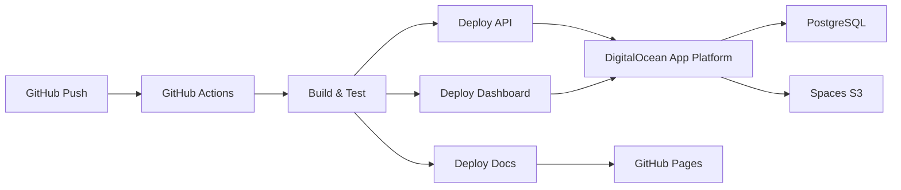

# Deployment

Learn how to deploy TruLedgr to production environments.

## Deployment Targets

TruLedgr is designed to be deployed on **DigitalOcean** using:

- **App Platform** for the API and web dashboard
- **Managed PostgreSQL** for the database
- **Spaces** for file storage (S3-compatible)

## Quick Deployment Guide

-   :material-cloud: [__DigitalOcean Setup__](digitalocean.md)
    
    ---
    
    Complete guide to deploying on DigitalOcean App Platform

-   :material-cog: [__Environment Variables__](environment.md)
    
    ---
    
    Required configuration and secrets management

-   :material-source-branch: [__CI/CD Pipeline__](cicd.md)
    
    ---
    
    GitHub Actions workflows for automated deployment

## Deployment Architecture

## Environments

| Environment | Branch | URL | Purpose |
|-------------|--------|-----|---------|
| Production | `main` | truledgr.app | Live production |
| Staging | `staging` | N/A | Pre-production validation |

## Security Considerations

- :material-lock: All traffic over HTTPS/TLS
- :material-key: Secrets managed via environment variables
- :material-shield: OAuth2 authentication required
- :material-backup-restore: Automated daily database backups
- :material-security: Regular security updates via Dependabot
