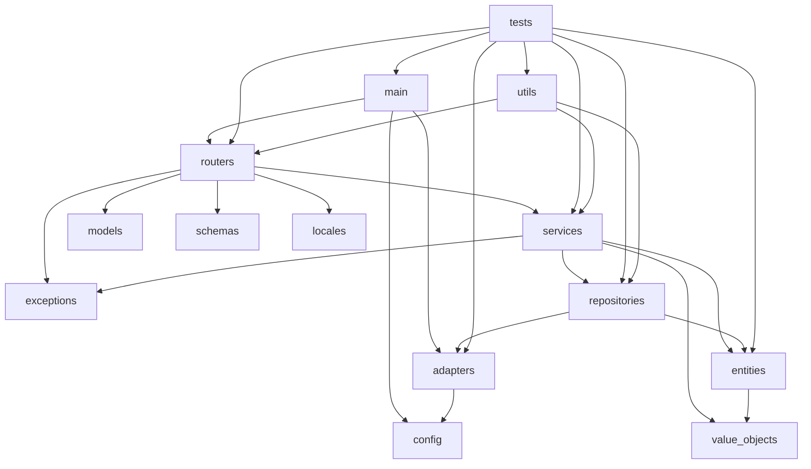

# API Architecture

## FastAPI Backend

The TruLedgr API is built with FastAPI, providing high-performance async endpoints with automatic OpenAPI documentation.

## Architectural Design

The API follows **Domain-Driven Design (DDD)**, **Clean Architecture**, and **Dependency Inversion Principle**. For a comprehensive guide to our architectural patterns, component types, and design principles, see:

**📖 [Domain-Driven Design & Clean Architecture Guide](../../architecture/ddd-clean-architecture.md)**

### Key Principles

- **Domain-Driven Design**: Business logic isolated in pure Python domain models
- **Clean Architecture**: Dependencies flow inward; domain has no framework dependencies
- **Dependency Inversion**: Domain defines interfaces; infrastructure provides implementations
- **Repository Pattern**: Abstract data access through Protocol interfaces
- **Unit of Work**: Atomic transactions across multiple repositories

## Core Endpoints

### Health and Status
- `GET /` - Root endpoint with welcome message
- `GET /health` - Health check endpoint

### Authentication
- `POST /auth/login` - OAuth2 login
- `POST /auth/logout` - User logout
- `GET /auth/me` - Current user info

### Financial Data (Planned)
- `GET /accounts` - List user accounts
- `POST /accounts` - Create new account
- `GET /transactions` - List transactions
- `POST /transactions` - Create transaction
- `GET /reports/monthly` - Monthly reports

## API Design Principles

- **RESTful**: Standard HTTP methods and status codes
- **Async**: All database operations use async/await
- **Validated**: Pydantic models for request/response validation
- **Documented**: Automatic OpenAPI/Swagger documentation
- **Versioned**: API versioning for backward compatibility

## Data Models

### Core Financial Models (Planned)
```python
class Account(BaseModel):
    id: UUID
    name: str
    account_type: AccountType
    balance: Decimal
    created_at: datetime

class Transaction(BaseModel):
    id: UUID
    account_id: UUID
    amount: Decimal
    description: str
    date: date
    category: str
```

## Development Server

```bash
cd truledgr
poetry run uvicorn truledgr.main:app --reload
```

- API: `http://localhost:8000`
- Documentation: `http://localhost:8000/docs`
- OpenAPI JSON: `http://localhost:8000/openapi.json`

## Error Handling

The API uses standard HTTP status codes and returns consistent error responses:

```json
{
  "detail": "Error message",
  "error_code": "SPECIFIC_ERROR_CODE"
}
```

## Authentication

Supports OAuth2 with multiple providers:
- Google
- Microsoft
- GitHub
- Apple

JWT tokens are used for API authentication after initial OAuth2 flow.

## Component Types

### 💡 The Golden Rule

> **If a component only exists to support another component, colocate them. If a component has value independently, separate it.**

This principle guides our decision to keep models and mappers inside `repositories/` rather than as separate top-level directories—they exist solely to support repository implementations. See [Why Models & Mappers Live in repositories/](../../architecture/MODELS_MAPPERS_LOCATION.md) for details.

### Component Types and Architectural Layers

| Architectural Layer      | Component Type   | Relationships / Responsibilities                                                                 |
|-------------------------|------------------|--------------------------------------------------------------------------------------------------|
| Entry Point             | main             | Application startup; wires together config, routers, adapters, services                          |
| Infrastructure          | adapters         | Bridge domain interfaces to external systems (DB, APIs); depend on repositories, services        |
| Infrastructure          | config           | Provide environment/configuration settings; used by main, adapters, services                     |
| Infrastructure          | locales          | Localization resources; used by routers, services                                                |
| Infrastructure          | repositories     | Data access abstraction; implement domain repository interfaces; used by services, adapters       |
| Domain                  | entities         | Core business objects; used by models, value_objects, repositories                               |
| Domain                  | models           | Pydantic models for validation; used by routers, services, entities                              |
| Domain                  | value_objects    | Immutable domain types; used by entities, services                                               |
| Presentation (API)      | routers          | Define API endpoints; depend on services, models, exceptions                                     |
| Presentation / Domain   | schemas          | Request/response validation; used by routers, models                                             |
| Application             | services         | Business logic orchestration; depend on repositories, entities, value_objects, exceptions        |
| Shared / Domain         | exceptions       | Define error types; used across all layers for error handling                                    |
| Shared                  | utils            | Helper functions; used across layers                                                            |
| Test                    | tests            | Validate all layers; depend on all components                                                    |

#### Relationships Overview

- **Routers** call **services** for business logic, use **models**/**schemas** for validation, and handle **exceptions**.
- **Services** orchestrate business logic, interact with **repositories**, **entities**, and **value_objects**.
- **Repositories** implement data access, often using **adapters** for external
- **Repositories** implement data access, often using **adapters** for external systems.
- **Entities** and **value_objects** represent core domain data, used by **services** and **repositories**.
- **Adapters** connect infrastructure (DB, APIs) to domain interfaces.
- **Config** and **locales** provide environment and localization support.
- **Main** initializes the app, wiring all components together.
- **Tests** validate all layers and interactions.
- **Utils** provide shared helpers.

#### Mermaid Diagram


