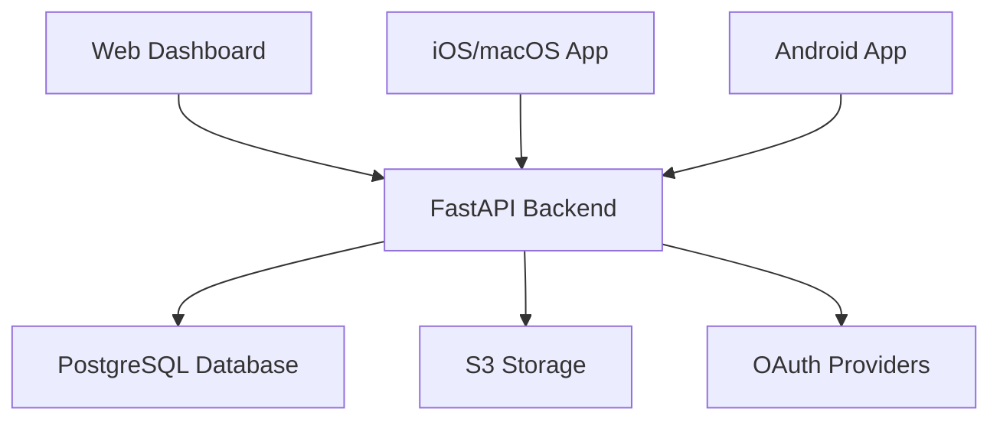

# Architecture

Learn about TruLedgr's comprehensive multi-platform architecture designed for modern personal finance management.

## System Design Philosophy

TruLedgr follows a **microservices-inspired architecture** with a central API backend and multiple platform-specific frontends. This approach provides:

- :material-shield-check: **Security** - Centralized authentication and authorization
- :material-sync: **Data Consistency** - Single source of truth for financial data
- :material-devices: **Cross-Platform** - Native experiences on every platform
- :material-scale-balance: **Scalability** - Independent scaling of components

## Core Components

### Backend Services

### Frontend Applications

Each frontend application is built with platform-native technologies:

| Platform | Technology | Features |
|----------|-----------|----------|
| Web | Vue 3 + Vite | Responsive, PWA-ready |
| iOS/macOS | SwiftUI | Native performance, shared codebase |
| Android | Jetpack Compose | Material Design 3 |

## Architecture Guides

-   :material-api: [__API Backend__](api.md)
    
    ---
    
    FastAPI, SQLAlchemy, Pydantic models, and async operations

-   :material-web: [__Frontend Web__](frontend.md)
    
    ---
    
    Vue 3 Composition API, Vite, and modern web standards

-   :material-cellphone: [__Mobile Apps__](mobile.md)
    
    ---
    
    Native iOS, macOS, and Android applications

-   :material-database: [__Database Design__](database.md)
    
    ---
    
    Schema design, migrations, and data modeling

-   :material-shield-account: [__Authentication__](auth.md)
    
    ---
    
    OAuth2, JWT tokens, and multi-provider authentication

## Design Principles

1. **Monthly Cycle Focus** - All features designed around monthly financial reporting
2. **ACID Compliance** - Transaction-level data integrity for financial operations
3. **Audit Trails** - Complete tracking of all financial modifications
4. **Decimal Precision** - Proper monetary value handling with Python's Decimal
5. **API-First** - All features accessible via documented REST API
