# TruLedgr Entity Relationship Diagrams

This document contains comprehensive Entity Relationship Diagrams (ERDs) for the TruLedgr application, covering both the database schema and API layer relationships.

## Database Schema ERD

### Core User Management

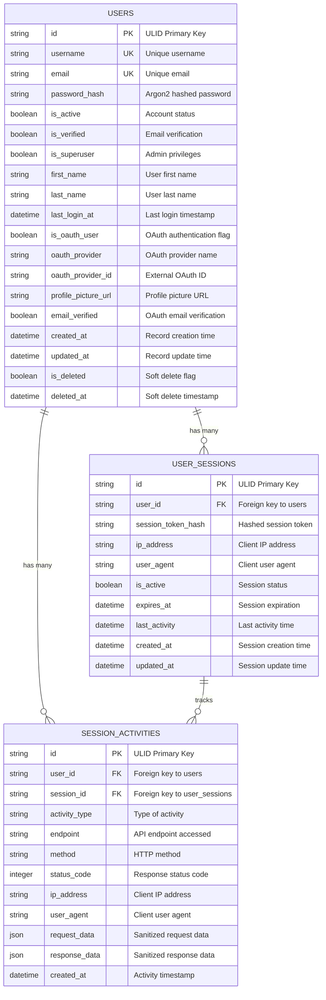

### Role-Based Access Control (RBAC)

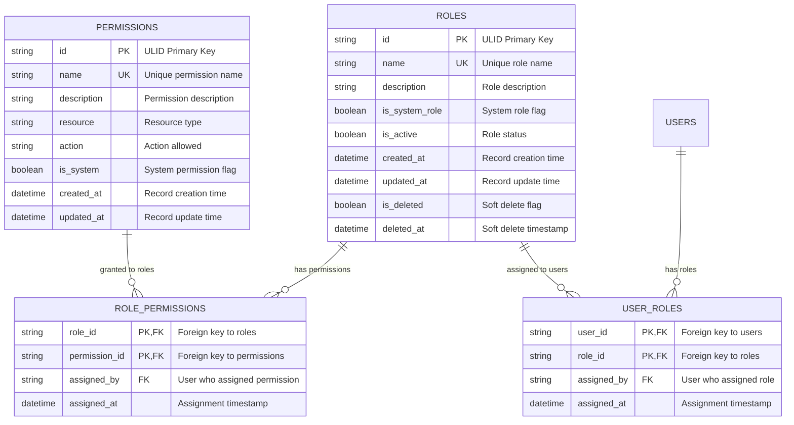

### Group Management

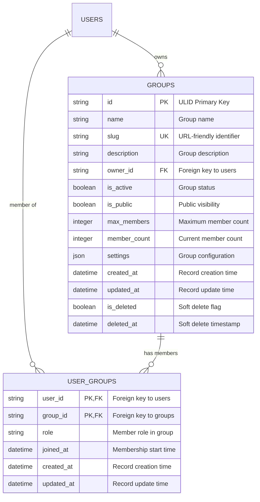

### Authentication Support

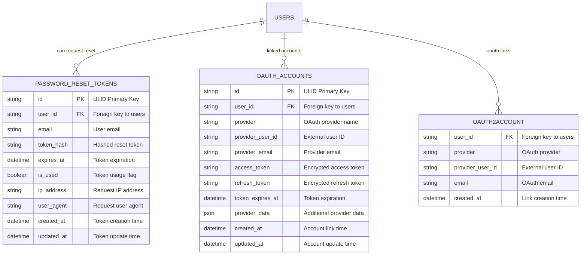

### Financial Data Models

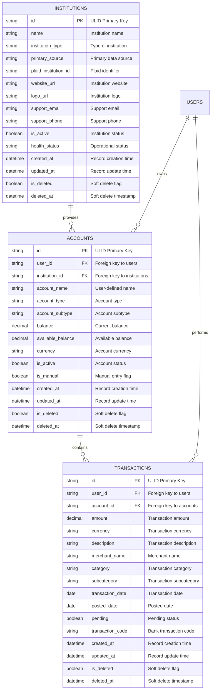

### Activity and Audit Trail

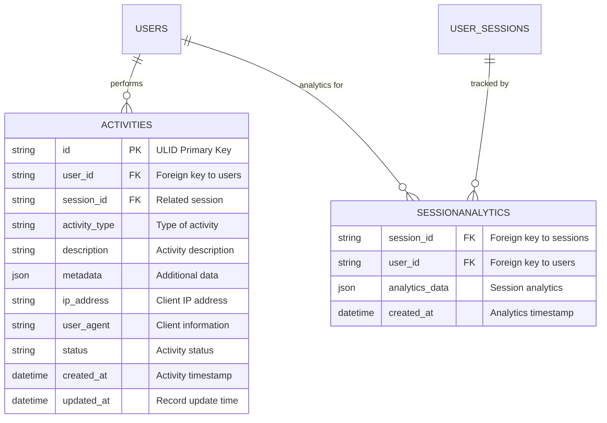

## API Layer Entity Relationships

### Authentication Flow

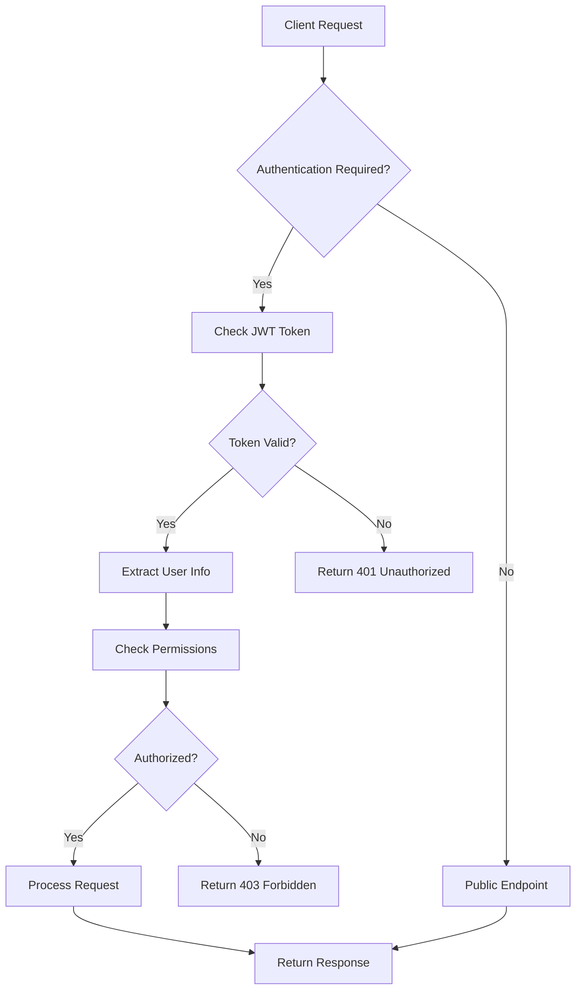

### User Management API Flow

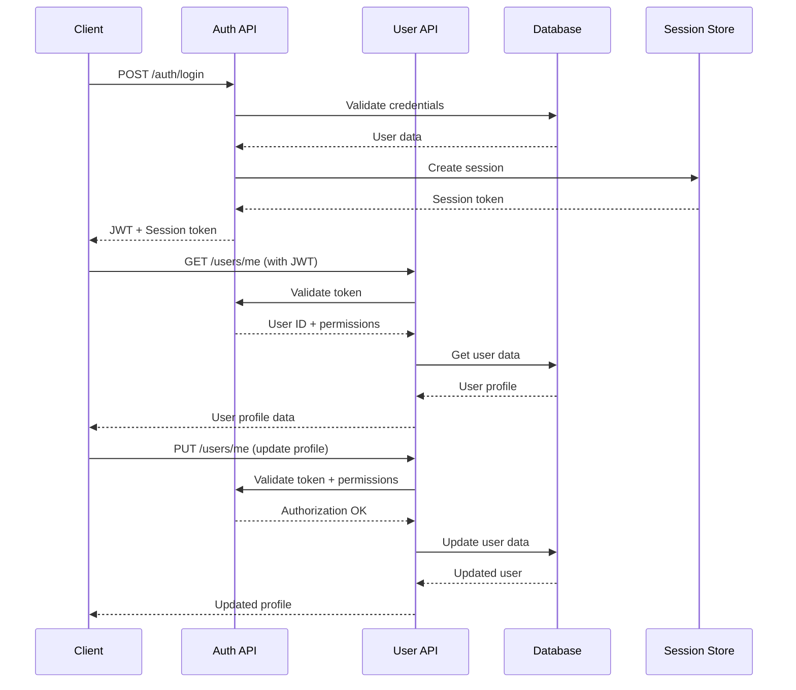

### RBAC API Flow

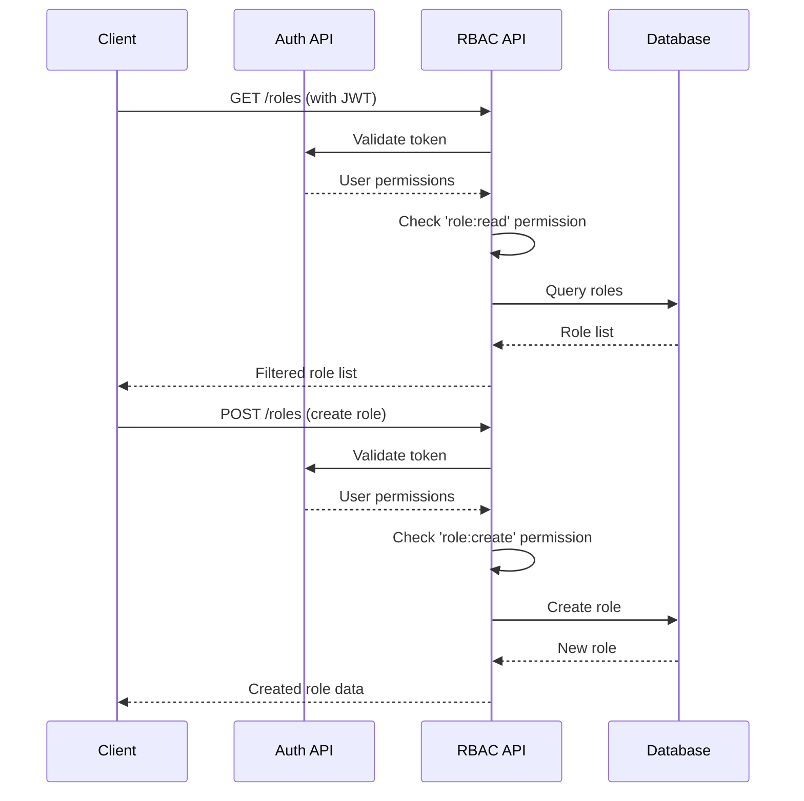

### Financial Data API Flow

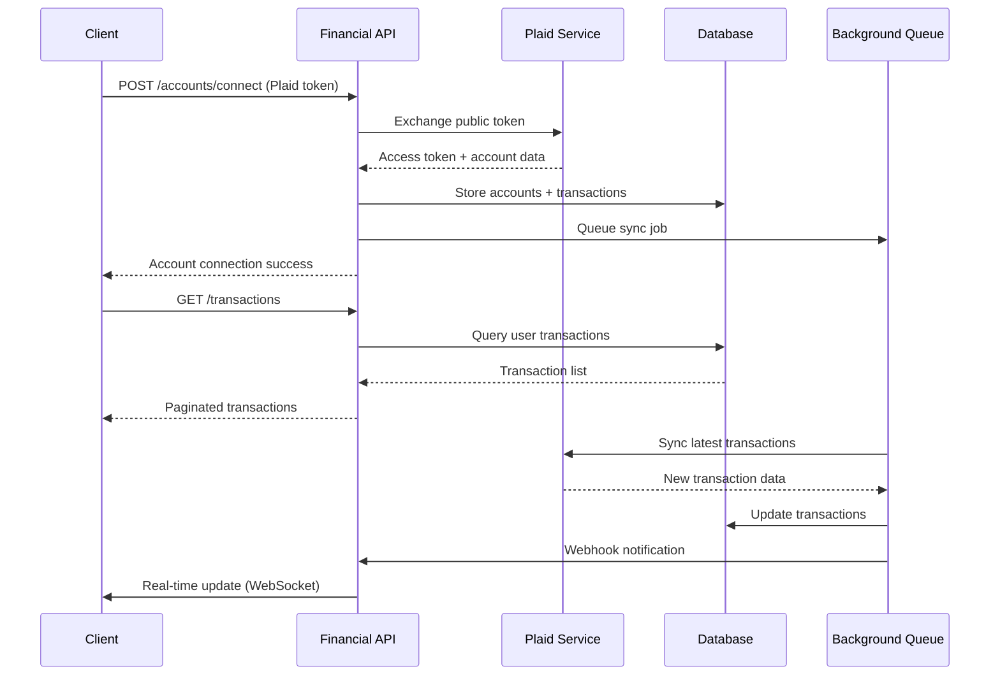

## Database Indexes and Performance

### Primary Indexes

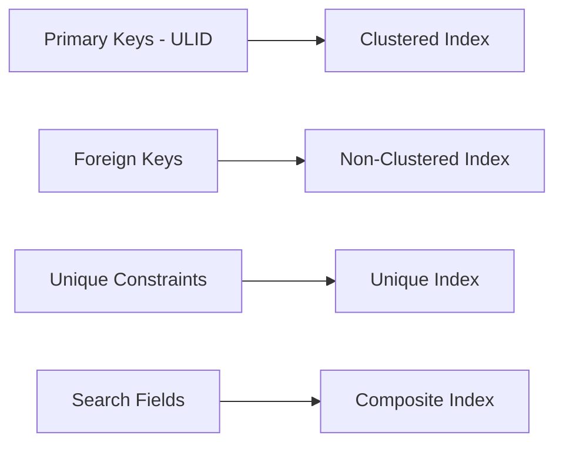

### Index Strategy

| Table | Index Type | Columns | Purpose |
|-------|------------|---------|---------|
| users | Unique | email | User lookup |
| users | Unique | username | User lookup |
| users | Composite | (is_active, is_deleted) | Active user queries |
| user_sessions | Unique | session_token_hash | Session validation |
| user_sessions | Composite | (user_id, is_active) | User session queries |
| transactions | Composite | (user_id, transaction_date) | Transaction history |
| transactions | Composite | (account_id, pending) | Account transactions |
| activities | Composite | (user_id, created_at) | Activity timeline |
| role_permissions | Composite | (role_id, permission_id) | Permission checks |

## API Response Schemas

### User Response Schema

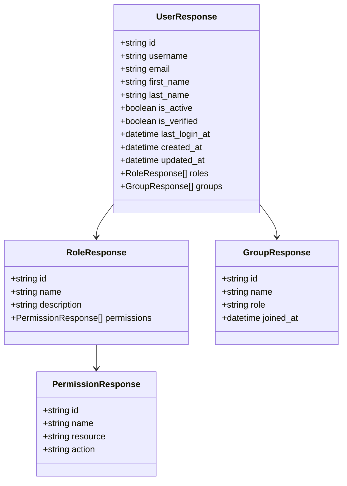

### Financial Response Schema

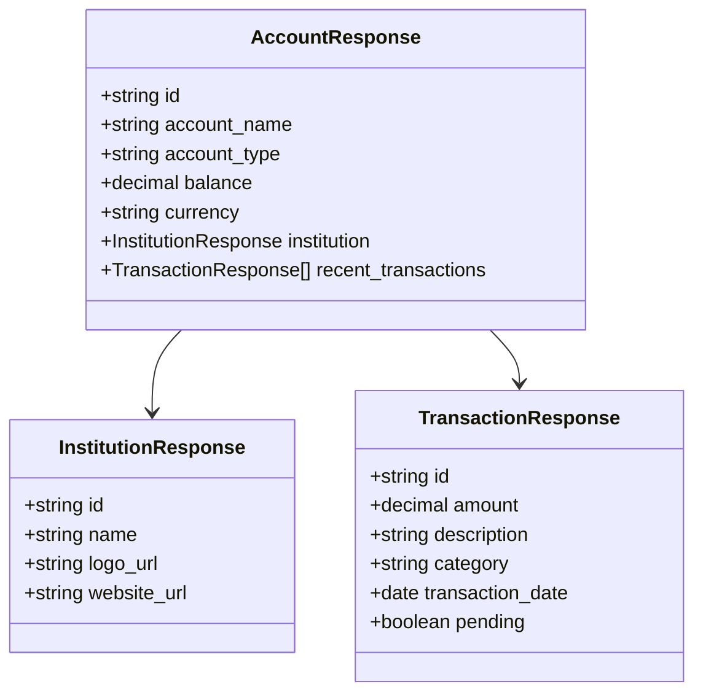

## Data Flow Architecture

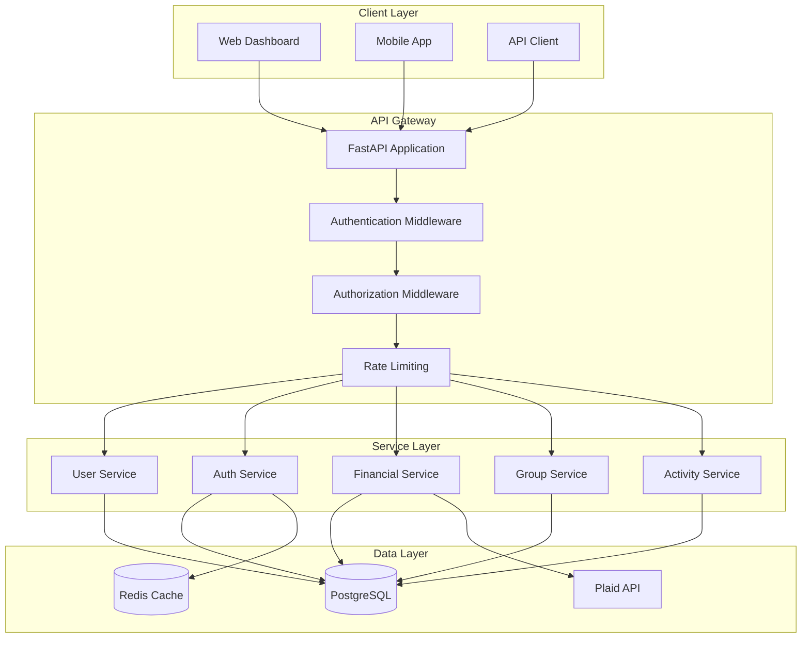

## Security Model

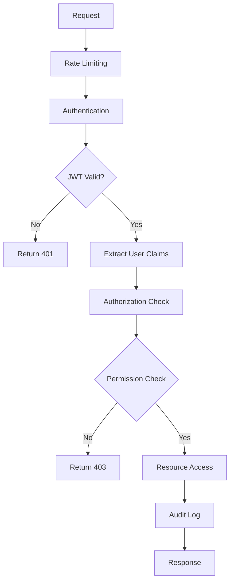

This comprehensive ERD documentation provides a complete view of your TruLedgr application's data architecture and API relationships. The diagrams use Mermaid syntax which renders well in GitHub, GitLab, and most documentation platforms.
