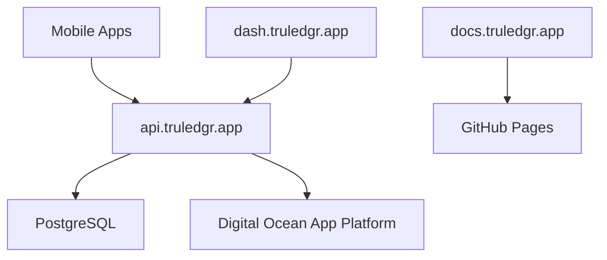

# TruLedgr Documentation

Welcome to the comprehensive documentation for the **TruLedgr** multi-platform application suite. This documentation covers everything from API endpoints to mobile integration and deployment strategies.

## 🚀 What is TruLedgr?

TruLedgr is a modern, cloud-native application suite designed for Digital Ocean's App Platform, featuring:

- **FastAPI Backend** - High-performance API server accessible at `api.truledgr.app`
- **Vue.js Dashboard** - Modern web interface accessible at `dash.truledgr.app`
- **Mobile Applications** - Native iOS and Android apps with offline capabilities
- **Secure Authentication** - JWT-based auth with biometric support

## 📋 Quick Start

=== "API Development"

    ```bash
    cd api/
    source .venv/bin/activate
    pip install -r requirements.txt
    uvicorn main:app --reload
    ```

=== "Frontend Development"

    ```bash
    cd dash/
    npm install
    npm run dev
    ```

=== "Documentation"

    ```bash
    source .venv/bin/activate
    mkdocs serve
    ```

## 🏗️ Architecture Overview



## 📚 Documentation Sections

### [🔌 API Documentation](api-landing-page.md)
Learn about the FastAPI backend, authentication, and available endpoints.

### [🖥️ Frontend Guide](frontend-deployment.md)
Explore the Vue.js dashboard and its integration with the API.

### [📱 Mobile Integration](mobile-integration.md)
Discover how to build iOS and Android apps that connect to the TruLedgr API.

### [🚀 Deployment](deployment-guide.md)
Complete guide for deploying to Digital Ocean App Platform.

### [⚙️ Project Structure](project-structure.md)
Understanding the codebase organization and development workflow.

## 🌟 Key Features

!!! success "Production Ready"
    - **High Performance**: Built with FastAPI for maximum speed
    - **Modern Stack**: Vue 3, TypeScript, and Composition API
    - **Cloud Native**: Optimized for Digital Ocean App Platform
    - **Mobile First**: API designed for offline-capable mobile apps

!!! info "Security"
    - **JWT Authentication**: Secure token-based authentication
    - **Biometric Support**: Touch ID and Face ID on mobile devices
    - **CORS Configuration**: Properly configured cross-origin requests
    - **Environment Variables**: Secure configuration management

!!! tip "Developer Experience"
    - **Auto Documentation**: Interactive API docs with Swagger/OpenAPI
    - **Hot Reload**: Development servers with instant updates
    - **Type Safety**: Full TypeScript support across the stack
    - **Clean Architecture**: Separation of concerns with clear folder structure

## 🚀 Live Environments

| Environment | URL | Purpose |
|-------------|-----|---------|
| **API** | [api.truledgr.app](https://api.truledgr.app) | Production API server |
| **Dashboard** | [dash.truledgr.app](https://dash.truledgr.app) | Web interface |
| **Documentation** | [docs.truledgr.app](https://docs.truledgr.app) | This documentation |
| **Repository** | [GitHub](https://github.com/McGuireTechnology/TruLedgr) | Source code |

## 🤝 Contributing

We welcome contributions! Please read our [development guidelines](project-structure.md) and check out the [project structure](project-structure.md) to get started.

### Development Workflow

1. **Clone the repository**
2. **Set up the environment** (Python 3.11+ and Node.js)
3. **Install dependencies** for both API and frontend
4. **Run the development servers**
5. **Make your changes** following our coding standards
6. **Submit a pull request**

## 📞 Support

- **Issues**: [GitHub Issues](https://github.com/McGuireTechnology/TruLedgr/issues)
- **Discussions**: [GitHub Discussions](https://github.com/McGuireTechnology/TruLedgr/discussions)
- **Email**: support@truledgr.app

---

*Built with ❤️ by McGuire Technology*
