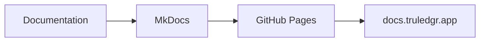

# MkDocs Documentation Setup Guide

This document describes how to work with the MkDocs documentation system for TruLedgr.

## Prerequisites

- Python 3.9 or higher
- Virtual environment activated
- Git repository initialized

## Installation

The documentation uses MkDocs with the Material theme and several useful plugins:

```bash
# Install MkDocs and plugins
pip install mkdocs mkdocs-material mkdocs-material-extensions \
            pymdown-extensions mkdocs-git-revision-date-localized-plugin \
            mkdocs-minify-plugin
```

## Local Development

### Start the Development Server

```bash
# Navigate to project root
cd /path/to/truledgr

# Activate virtual environment
source .venv/bin/activate

# Start MkDocs server
mkdocs serve
```

The documentation will be available at `http://127.0.0.1:8000`

### Building the Site

```bash
# Build static site
mkdocs build

# Build and serve (for testing)
mkdocs serve
```

## Project Structure

```
docs/
├── index.md              # Homepage
├── api-landing-page.md   # API documentation
├── deployment-guide.md   # Deployment instructions
├── mobile-integration.md # Mobile app integration
├── project-structure.md  # Project structure guide
├── stylesheets/
│   └── extra.css        # Custom CSS
├── javascripts/
│   └── mathjax.js       # MathJax configuration
├── includes/
│   └── mkdocs.md        # Shared content/abbreviations
└── assets/
    └── favicon.png      # Site favicon

mkdocs.yml                # MkDocs configuration
```

## Configuration

The `mkdocs.yml` file contains the complete configuration:

- **Theme**: Material Design theme with custom colors
- **Plugins**: Search, minification, git revision dates
- **Extensions**: Code highlighting, admonitions, tabs, etc.
- **Navigation**: Organized sections for different topics

## Deployment

### GitHub Pages Deployment

The repository includes a GitHub Actions workflow (`.github/workflows/docs.yml`) that automatically:

1. Builds the documentation on pushes to `main`
2. Deploys to GitHub Pages
3. Makes it available at `docs.truledgr.app`

### Custom Domain Setup

1. **DNS Configuration**: Point `docs.truledgr.app` to GitHub Pages
2. **CNAME File**: Already created in `docs/CNAME`
3. **GitHub Settings**: Configure custom domain in repository settings

## Writing Documentation

### Markdown Features

The documentation supports advanced Markdown features:

#### Code Blocks
```python
def hello_world():
    return "Hello, TruLedgr!"
```

#### Admonitions
!!! tip "Pro Tip"
    Use admonitions to highlight important information.

!!! warning "Important"
    Always test your documentation locally before pushing.

#### Tabs
=== "Python"
    ```python
    print("Hello from Python!")
    ```

=== "JavaScript"
    ```javascript
    console.log("Hello from JavaScript!");
    ```

#### Mermaid Diagrams


## Content Guidelines

### File Organization

- Keep related content in the same section
- Use descriptive filenames
- Include proper navigation in `mkdocs.yml`

### Writing Style

- Use clear, concise language
- Include code examples where appropriate
- Add diagrams for complex concepts
- Use proper headings hierarchy

### Link Management

- Use relative links for internal pages
- Include proper alt text for images
- Test all external links regularly

## Customization

### Theme Customization

- **Colors**: Modify CSS variables in `extra.css`
- **Fonts**: Configure in `mkdocs.yml`
- **Layout**: Adjust navigation and footer

### Plugin Configuration

Popular plugins already configured:

- **Search**: Enhanced search functionality
- **Minify**: Optimizes output for production
- **Git Revision**: Shows last update dates
- **Code Highlighting**: Syntax highlighting for code blocks

## Troubleshooting

### Common Issues

1. **Build Errors**: Check `mkdocs.yml` syntax
2. **Missing Pages**: Ensure files are listed in navigation
3. **Plugin Errors**: Verify all plugins are installed
4. **Theme Issues**: Check Material theme version compatibility

### Debug Commands

```bash
# Verbose build output
mkdocs build --verbose

# Check configuration
mkdocs config

# Serve with auto-reload disabled
mkdocs serve --no-livereload
```

## Best Practices

1. **Preview Changes**: Always test locally before committing
2. **Link Validation**: Ensure all links work correctly  
3. **Image Optimization**: Optimize images for web
4. **Mobile Testing**: Verify responsive design
5. **SEO**: Use proper meta descriptions and titles

## Contributing

1. Create a feature branch for documentation changes
2. Test locally using `mkdocs serve`
3. Submit pull requests with clear descriptions
4. Follow the existing documentation style

## Resources

- [MkDocs Documentation](https://www.mkdocs.org/)
- [Material Theme Guide](https://squidfunk.github.io/mkdocs-material/)
- [PyMdown Extensions](https://facelessuser.github.io/pymdown-extensions/)
- [GitHub Pages Documentation](https://docs.github.com/en/pages)
