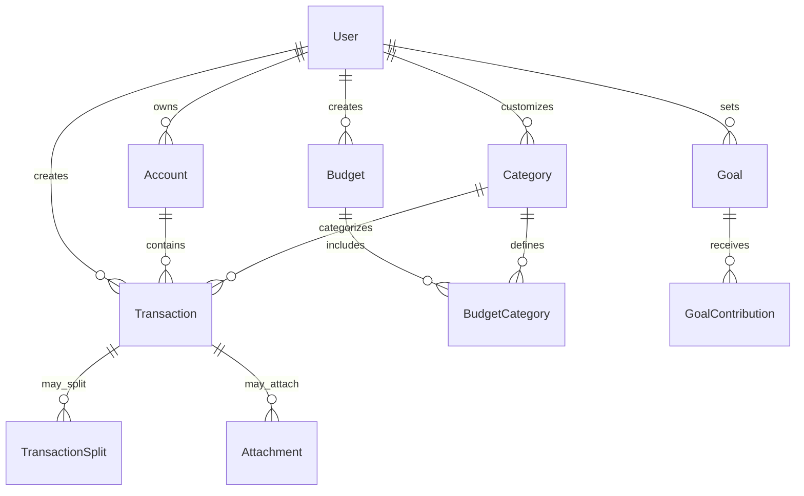

# Data Model Reference

Complete reference for TruLedgr's data structure, relationships, and technical implementation details.

## Core Entities

### User

The User entity represents an individual account holder within TruLedgr.

```json
{
  "id": "user_123456789",
  "email": "user@example.com",
  "profile": {
    "firstName": "John",
    "lastName": "Doe",
    "displayName": "John D.",
    "timezone": "America/New_York",
    "currency": "USD",
    "dateFormat": "MM/dd/yyyy",
    "language": "en-US"
  },
  "preferences": {
    "theme": "auto",
    "notifications": {
      "email": true,
      "push": true,
      "sms": false
    },
    "privacy": {
      "shareAnalytics": true,
      "marketingEmails": false
    }
  },
  "subscription": {
    "plan": "individual",
    "status": "active",
    "renewalDate": "2024-12-31T23:59:59Z"
  },
  "security": {
    "mfaEnabled": true,
    "lastLogin": "2024-01-15T10:30:00Z",
    "loginCount": 156
  },
  "createdAt": "2023-01-15T09:00:00Z",
  "updatedAt": "2024-01-15T10:30:00Z"
}
```

**Field Descriptions:**

- `id`: Unique identifier for the user
- `email`: Primary email address (also serves as login)
- `profile`: Personal information and localization settings
- `preferences`: User interface and notification preferences
- `subscription`: Current subscription plan and status
- `security`: Security-related metadata
- `createdAt/updatedAt`: Timestamp tracking

### Account

Financial accounts connected to or created within TruLedgr.

```json
{
  "id": "acc_987654321",
  "userId": "user_123456789",
  "name": "Chase Checking",
  "type": "checking",
  "subtype": "checking",
  "institution": {
    "id": "ins_chase",
    "name": "Chase Bank",
    "logo": "https://cdn.truledgr.com/logos/chase.png",
    "primaryColor": "#005BAA"
  },
  "connection": {
    "type": "plaid",
    "accountId": "plaid_account_123",
    "itemId": "plaid_item_456",
    "lastSync": "2024-01-15T08:00:00Z",
    "syncStatus": "success",
    "syncFrequency": "daily"
  },
  "balance": {
    "current": 2543.67,
    "available": 2543.67,
    "limit": null,
    "currency": "USD",
    "lastUpdated": "2024-01-15T08:00:00Z"
  },
  "properties": {
    "accountNumber": "****1234",
    "routingNumber": "021000021",
    "apr": null,
    "minimumPayment": null,
    "dueDate": null
  },
  "status": "active",
  "isHidden": false,
  "displayOrder": 1,
  "createdAt": "2023-02-01T10:00:00Z",
  "updatedAt": "2024-01-15T08:00:00Z"
}
```

**Account Types:**
- `checking`: Standard checking accounts
- `savings`: Savings accounts
- `credit`: Credit cards and lines of credit
- `investment`: Investment and brokerage accounts
- `loan`: Loans and mortgages
- `other`: Other financial accounts

### Transaction

Individual financial transactions within accounts.

```json
{
  "id": "txn_555666777",
  "accountId": "acc_987654321",
  "userId": "user_123456789",
  "amount": -85.42,
  "currency": "USD",
  "date": "2024-01-15",
  "postedDate": "2024-01-15",
  "description": "GROCERY STORE #123",
  "originalDescription": "GROCERY STORE #123 ATLANTA GA",
  "merchant": {
    "name": "Grocery Store",
    "category": "Grocery Stores",
    "logo": "https://cdn.truledgr.com/merchants/grocery.png"
  },
  "category": {
    "primary": "Food & Drink",
    "detailed": "Groceries",
    "id": "cat_groceries",
    "confidence": 0.95
  },
  "payee": "Grocery Store",
  "reference": null,
  "notes": "Weekly grocery shopping",
  "tags": ["grocery", "weekly"],
  "location": {
    "address": "123 Main St, Atlanta, GA",
    "city": "Atlanta",
    "state": "GA",
    "zipCode": "30309",
    "country": "US",
    "coordinates": {
      "latitude": 33.7490,
      "longitude": -84.3880
    }
  },
  "metadata": {
    "source": "plaid",
    "transactionId": "plaid_txn_789",
    "pending": false,
    "accountOwner": null
  },
  "splits": [],
  "attachments": [],
  "status": "cleared",
  "isRecurring": false,
  "recurringId": null,
  "createdAt": "2024-01-15T08:05:00Z",
  "updatedAt": "2024-01-15T09:30:00Z"
}
```

**Transaction Statuses:**
- `pending`: Transaction is pending/processing
- `cleared`: Transaction has cleared the account
- `reconciled`: Transaction has been manually reconciled

### Category

Hierarchical categorization system for transactions.

```json
{
  "id": "cat_groceries",
  "name": "Groceries",
  "parent": "cat_food_drink",
  "type": "expense",
  "color": "#4CAF50",
  "icon": "shopping-cart",
  "description": "Food and household items from grocery stores",
  "keywords": ["grocery", "food", "supermarket", "kroger", "walmart"],
  "isSystem": true,
  "isActive": true,
  "userId": null,
  "statistics": {
    "transactionCount": 156,
    "totalAmount": -3247.89,
    "averageAmount": -20.82,
    "lastTransaction": "2024-01-15"
  },
  "createdAt": "2023-01-01T00:00:00Z",
  "updatedAt": "2024-01-15T09:30:00Z"
}
```

**Category Types:**
- `income`: Income categories
- `expense`: Expense categories
- `transfer`: Transfer categories
- `investment`: Investment-related categories

### Budget

Monthly or periodic budget allocations for categories.

```json
{
  "id": "budget_202401",
  "userId": "user_123456789",
  "name": "January 2024 Budget",
  "period": {
    "type": "monthly",
    "year": 2024,
    "month": 1,
    "startDate": "2024-01-01",
    "endDate": "2024-01-31"
  },
  "totalIncome": 5000.00,
  "totalExpenses": 4200.00,
  "totalSavings": 800.00,
  "categories": {
    "cat_groceries": {
      "budgeted": 400.00,
      "spent": 385.42,
      "remaining": 14.58,
      "percentage": 96.36,
      "status": "on_track"
    },
    "cat_rent": {
      "budgeted": 1500.00,
      "spent": 1500.00,
      "remaining": 0.00,
      "percentage": 100.00,
      "status": "complete"
    }
  },
  "status": "active",
  "template": "50_30_20",
  "isRecurring": true,
  "notes": "First budget of the year",
  "createdAt": "2023-12-31T15:00:00Z",
  "updatedAt": "2024-01-15T09:30:00Z"
}
```

**Budget Statuses:**
- `draft`: Budget is being created
- `active`: Current active budget
- `complete`: Budget period has ended
- `archived`: Old budget kept for reference

### Goal

Financial goals and savings targets.

```json
{
  "id": "goal_vacation",
  "userId": "user_123456789",
  "name": "Summer Vacation",
  "description": "Save for family vacation to Hawaii",
  "type": "savings",
  "targetAmount": 5000.00,
  "currentAmount": 1250.00,
  "currency": "USD",
  "targetDate": "2024-06-01",
  "category": "cat_vacation",
  "priority": "high",
  "status": "active",
  "progress": {
    "percentage": 25.0,
    "monthlyRequired": 833.33,
    "onTrack": true,
    "projectedCompletion": "2024-05-15"
  },
  "contributions": [
    {
      "date": "2024-01-01",
      "amount": 250.00,
      "source": "manual"
    },
    {
      "date": "2024-01-15",
      "amount": 1000.00,
      "source": "bonus"
    }
  ],
  "automation": {
    "enabled": true,
    "amount": 200.00,
    "frequency": "monthly",
    "nextContribution": "2024-02-01"
  },
  "createdAt": "2024-01-01T00:00:00Z",
  "updatedAt": "2024-01-15T09:30:00Z"
}
```

**Goal Types:**
- `savings`: General savings goals
- `debt_payoff`: Debt reduction goals
- `emergency_fund`: Emergency fund targets
- `investment`: Investment targets

## Data Relationships

### Entity Relationship Diagram



### Foreign Key Relationships

**Primary Relationships:**
- `Transaction.accountId` → `Account.id`
- `Transaction.userId` → `User.id`
- `Transaction.categoryId` → `Category.id`
- `Account.userId` → `User.id`
- `Budget.userId` → `User.id`
- `Goal.userId` → `User.id`

**Secondary Relationships:**
- `TransactionSplit.transactionId` → `Transaction.id`
- `Attachment.transactionId` → `Transaction.id`
- `GoalContribution.goalId` → `Goal.id`

## API Schemas

### Request/Response Formats

**Create Transaction Request:**
```json
{
  "accountId": "acc_987654321",
  "amount": -85.42,
  "date": "2024-01-15",
  "description": "Grocery Store",
  "categoryId": "cat_groceries",
  "notes": "Weekly shopping"
}
```

**Transaction List Response:**
```json
{
  "data": [
    {
      "id": "txn_555666777",
      "amount": -85.42,
      "date": "2024-01-15",
      "description": "Grocery Store",
      "category": {
        "id": "cat_groceries",
        "name": "Groceries"
      },
      "account": {
        "id": "acc_987654321",
        "name": "Chase Checking"
      }
    }
  ],
  "pagination": {
    "page": 1,
    "limit": 50,
    "total": 156,
    "hasMore": true
  },
  "filters": {
    "dateRange": "2024-01-01:2024-01-31",
    "accountIds": ["acc_987654321"],
    "categoryIds": ["cat_groceries"]
  }
}
```

## Data Validation Rules

### Field Validation

**Required Fields:**
- `User.email`: Valid email format
- `Account.name`: 1-100 characters
- `Transaction.amount`: Non-zero number
- `Transaction.date`: Valid date format

**Format Validation:**
- Amounts: Up to 2 decimal places
- Dates: ISO 8601 format (YYYY-MM-DD)
- Currency: 3-letter ISO currency codes
- Emails: RFC 5322 compliant

**Business Rules:**
- Transaction dates cannot be more than 1 year in the future
- Budget amounts must be positive
- Goal target dates must be in the future
- Account balances must match transaction history

## Data Retention Policies

### Retention Periods

**User Data:**
- Active users: Retained indefinitely
- Inactive users (2+ years): Account archived
- Deleted accounts: 30-day soft delete, then permanent removal

**Transaction Data:**
- All plans: Minimum 7 years retention
- Free plan: 1 year of active access
- Paid plans: Unlimited access to all historical data

**Audit Logs:**
- Security events: 2 years
- User actions: 1 year
- System logs: 90 days

### Data Backup

**Backup Schedule:**
- Real-time: Critical user actions
- Hourly: Transaction and account updates
- Daily: Full database backup
- Weekly: Off-site backup verification

## Privacy and Security

### Data Encryption

**At Rest:**
- AES-256 encryption for all stored data
- Separate encryption keys per user
- Hardware security modules (HSM) for key management

**In Transit:**
- TLS 1.3 for all API communications
- Certificate pinning for mobile apps
- End-to-end encryption for sensitive operations

### Data Access Controls

**User Data Access:**
- Users can access only their own data
- Family plan members see shared household data
- Admin users have limited system access

**Internal Access:**
- Strict need-to-know basis
- All access logged and monitored
- Regular access reviews and audits

### Compliance

**Regulatory Compliance:**
- GDPR (General Data Protection Regulation)
- CCPA (California Consumer Privacy Act)
- SOX (Sarbanes-Oxley Act)
- PCI DSS Level 1

**Data Rights:**
- Right to access: API and export features
- Right to portability: Multiple export formats
- Right to deletion: Complete data removal
- Right to rectification: User-controlled updates

---

*For technical integration questions, see our [API documentation](../integrations/overview.md) or [contact our developer support team](../support/overview.md#developer-support).*
